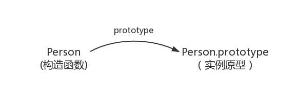
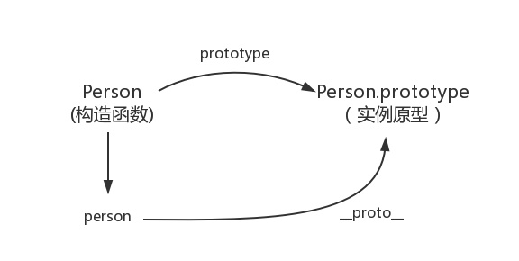
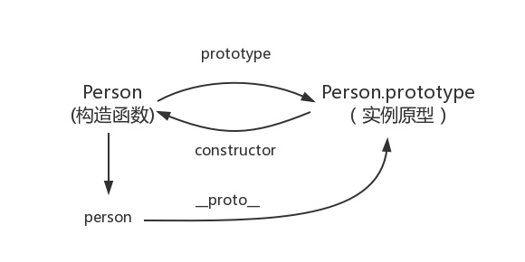
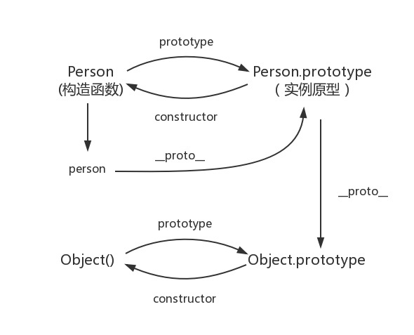
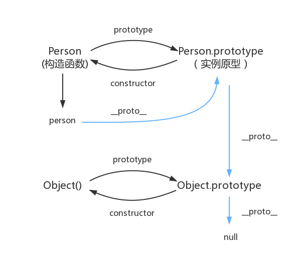

### 原型和原型链
1. `原型`：JS中的构造函数对象都包含了一个prototype的内部属性，这个属性所对应的就是该对象的原型。

2. `原型链`：原型链是是有一些用来继承和共享属性的对象组成的对象链。并且原型链的长度是有限的。

3. `构造函数`：原型对象包含一个constructor属性，对应创建所有指向该原型的实例的构造函数。    


#### 构造函数创建对象   

```
    //构造函数创建对象
    function Person(){
       
    }
    let person = new Person();
    person.name = '666';
    console.log('name',person.name);//666
    //在这个例子中，Person就是一个构造函数，我们使用new创建了一个实例对象person。
 ```

 #### prototype
每个函数都有一个prototype属性,`prototype是函数才会有的属性 `
```
function Person() {
 
}
Person.prototype.name = 'name';
var person1 = new Person();
var person2 = new Person();
console.log(person1.name) // name
console.log(person2.name) // name
```
那这个函数的prototype属性到底指向的是什么呢？是这个函数的原型吗？

其实，`函数的prototype属性指向了一个对象，这个对象正是调用该构造函数而创建的实例的原型,也就是这个例子中的person1和person2的原型。`

那么什么是原型呢？你可以这样理解：`每一个JavaScript对象(null除外)在创建的时候就会与之关联另一个对象，这个对象就是我们所说的原型`，每一个对象都会从原型”继承”属性。  

让我们用一张图表示构造函数和实例原型之间的关系：
   

在这张图中我们用`Object.prototype表示实例原型`

那么我们该怎么表示实例与实例原型，也就是person和Person.prototype之间的关系呢，这时候我们就要讲到第二个属性：

#### __proto__
这是每一个JavaScript对象(除了null)都具有的一个属性，叫__proto__，这个属性会指向该对象的原型。

```
console.log("构造函数原型和对象原型比较",Person.prototype === person.__proto__)//true
```
于是我们更新下关系图：

  

 既然实例对象和构造函数都可以指向原型，那么原型是否有属性指向构造函数或者实例呢？  

 #### constructor

 指向实例倒是没有，因为一个构造函数可以生成多个实例，但是原型指向构造函数倒是有的，这就要讲到第三个属性：constructor，每个原型都有一个constructor属性指向关联的构造函数

为了验证这一点，我们可以尝试：
```
 console.log("原型指向构造函数",Person.prototype.constructor === Person);
 ```
更新关系图为:
  

 综上：我们得出
 ```
function Person() {
}
 
var person = new Person();
console.log(person.__proto__ == Person.prototype) // true
console.log(Person.prototype.constructor == Person) // true
// 顺便学习一个ES5的方法,可以获得对象的原型
console.log(Object.getPrototypeOf(person) === Person.prototype) //true
```

#### 实例与原型
当读取实例的属性时，如果找不到，就会查找与对象关联的原型中的属性，如果还查不到，就去找原型的原型，一直找到最顶层为止。
```
function Person() {
 
}
 
Person.prototype.name = 'name';
 
var person = new Person();
 
person.name = 'name of this person';
console.log(person.name) // name of this person
 
delete person.name;
console.log(person.name) // name
```
在这个例子中，我们设置了person的name属性，所以我们可以读取到为name of this person，当我们删除了person的name属性时，读取person. name，从person中找不到就会从person的原型也就是person._proto_== Person.prototype中查找，幸运的是我们找到了为’name’，但是万一还没有找到呢？原型的原型又是什么呢？

在前面，我们已经讲了原型也是一个对象，既然是对象，我们就可以用最原始的方式创建它，那就是
```
var obj = new Object();
obj.name = 'name'
console.log(obj.name) // name

console.log(person.__proto__.__proto__ === Object.prototype);//true
```
所以原型对象是通过Object构造函数生成的，结合之前所讲,实例的__proto__指向构造函数的prototype,所以我们再更新下关系图：
   

 #### 原型链
那Object.prototype的原型呢？

null，嗯，就是null,所以查到Object.prototype就可以停止查找了

所以最后一张关系图就是
   

 顺便还要说一下，图中由相互关联的原型组成的链状结构就是原型链，也就是蓝色的这条线。
