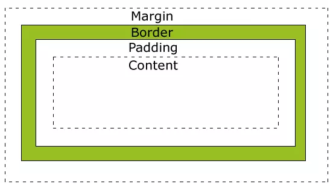

## 盒模型
### 盒子模型简介  
   
 上面是一个盒子模型图，一个盒子包括了content（实际内容）、border（边框）、padding（内边距）和margin（外边距）。  
 * content（实际内容）：  
 盒子的内容，显示文本和图像。`我们给元素设置的width和height其实是content的宽高`，如果指定高度大于显示内容所需高度，多余的高度会产生类似内边距一样的效果；如果指定高度小于显示内容所需高度，会出现滚动条。如果元素内容的高度大于元素框的高度，浏览器的具体行为取决于overflow属性。  
 * border（边框）:  
 元素的边框是围绕元素内容的内边距的一条或多条线。边框由粗细、样式和颜色三部分组成。  
 * padding（内边距）:  
 清除内容周围的区域，内边距是透明的，取值不能为负，受盒子的Background属性影响，padding是有背景的。
 * margin（外边距）:  
 在元素外创建额外的空白，空白通常指不能放其他元素的区域，而且在这个区域中可以看到父元素的背景（padding所带的是本身的背景而非父元素）。margin经常取负值实现定位的作用。外边距有一个合并问题，经常使人们混淆，简单来说，外边距合并指的是，当两个垂直外边距相遇时，它们将形成一个外边距。合并后的外边距的高度等于两个发生合并的外边距的高度中的较大者。  

### box-sizing有三个取值：

1、content-box:使元素遵循标准 w3c 盒子模型（默认值）。  

2、border-box:使元素遵循ie 盒子模型。  

3、 inherit： 规定应从父元素继承 box-sizing 属性的值。  
