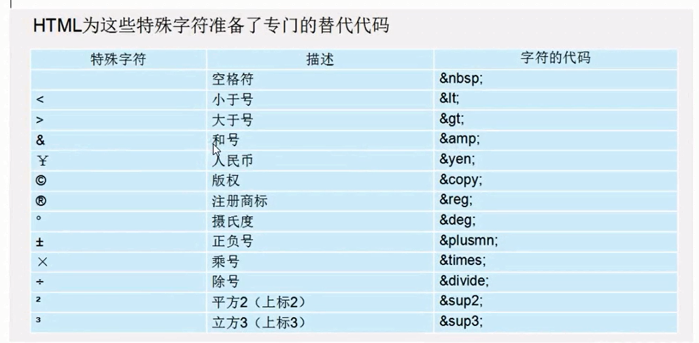
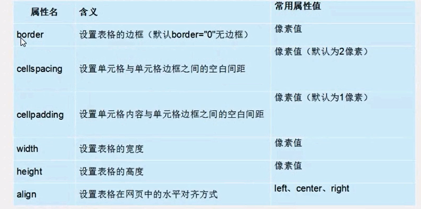
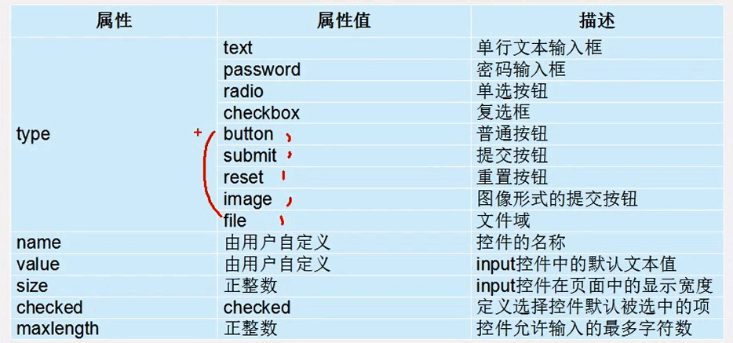

## 网页（web）
* 组成:文字、图像、超链接、音频、视频、flash

## 浏览器
* 代码==》浏览器（中介、渲染）==》页面  
* 浏览器内核：渲染引擎和js引擎   
Trident（ie内核）  
Gecko（firefox内核）  
webkit（safari内核）
chromium/blink（chrome内核）    

* web标准  
结构标准：xml html  
样式标准：css  
行为标准：dom  js  

* html初识  

```
<html> //html标签：作用所有html标签的根节点
    <head>//用于存放 title meta base style script link
        <title></title>
    </head>
    <body>
    </body>
</html>
```
*  标签分类  
1.双标签  
2.单标签  ```<br />```  

### 排版标签
* head  \<h1>\</h1>-- \<h6>\</h6>
* 段落标签 \<p>\</p>  
* 水平标签 \<hr />  

### 换行标签
* \<br />

### div span标签  没有语义 用于布局  

### 文本格式化标签  
* b \<b>\</b>加粗
* `strong(推荐使用) 加粗`
* i 倾斜
* `em(推荐使用) 倾斜`
* s 删除线
* `del (推荐使用) 删除线`
* u 下划线
* `ins(推荐) 下划线`  
***

## 标签属性
\<hr  width = "500" color="pink"/>

***
### 图像标签
* \   
src是必须属性  ：图像路径  
alt图片不能显示时的的替换文字  
title 鼠标放上去悬停时候显示的文字  
width height `一般情况下只需要更改高度或宽度 其余会等比缩放`  
border 边框  

### 链接标签
* \<a href="http://www.baidu.com">\</a>  
href跳转的路径  
链接地址必须以http://开头  

### 锚点定位 适合于较长的页面  
1.使用\<a href="#id名">链接文本\</a>创建链接文本  
2.目标点用id
```
    <a href="#life">个人生活</a>
    <h3 id="life">个人生活</h3>
```

### base标签
* \<base  target="_blank"/> 页面中所有链接在新窗口打开 (head中) 单个不在新窗口target = "_self"  


###　特殊字符标签
* 空格 \&nbsp;
* 小于 \&lt;
* 大于 \&gt;
   


 ### 注释标签  
 \<!--注释-->
 * 单行注释  ctrl+/
 * 多行注释 ctrl+shift+/  
***

### 列表
* 无序列表：各个列表之间没有顺序级别之分,是并列的
```
    <ul>
        <li>草莓</li>
        <li>草莓</li>
        <li>草莓</li>
        <li>草莓</li>
        <li>草莓</li>
    </ul>
 ```
`ul里只能放li`  
`li标签里可以放任何标签`
* 有序列表
```
    <ol>
        <li>中国</li>
        <li>美国</li>
        <li>英国</li>
        <li>俄罗斯</li>
        <li>顾小怼</li>
    </ol>
```
* 自定义列表
```
    <dl>
        <dt>定义标题</dt>
        <dd>定义描述、解释</dd>
    </dl>
```

### 表格（处理表格式数据）
```
    <table border="1" cellspacing="0" cellpadding="5" width="500" height="250" align="center">
        <caption>我喜欢的男明星</caption>
        <thead>
            <tr>
                <th>姓名</th>
                <th>性别</th>
                <th>年龄</th>
            </tr>
        </thead>
        <tbody>
            <tr>
                <td>张艺兴</td>
                <td>男</td>
                <td>28</td>
            </tr>
        </tbody>
    </table>
```
* 属性
   
 * 合并单元格 rowspan跨行合并 colspan跨列合并

 ### 表单
 * 表单域
 * 提示
 * 表单控件  \<input type="">
    
   
* label标签 与input配合
```
//用label直接包裹
<label>输入账号：
    <input />
</label>
```
```
//多个input使用for  id
<label for="two">输入账号：
    <input>
    <input id="two">
</label>
```

* 文本域
```
 <textarea cols="50" rows="10">请输入留言</textarea>
 ```
 * 下拉菜单
 ```
     <select>
        <option>--请选择--</option>
        <option>北京</option>
        <option selected="selected">上海</option>
    </select>
```

* 表单域
```
    <form action="#" method="POST">
        <p>用户名：<input type="text" name="username"/></p>
        <p>密&nbsp;码：<input type="password" name="password"></p>
        <input type="submit" value="提交">
        <input type="reset" value="重置">
    </form>
```
`get速度快  不能做密码提交  post速度慢 不会显示表单内容 安全`