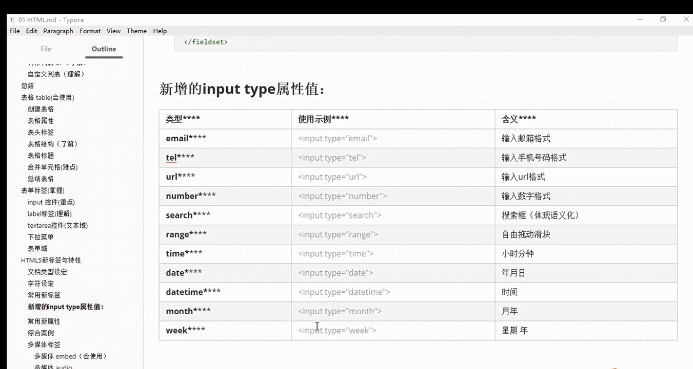

* header 头部 页眉
* nav 导航栏
* footer 底部
* article 文章
* section 定义区域
* aside 定义侧边
* datalist 跟input搭配使用
```
    <input type="text" value="输入名称" list="star">
    <datalist id="star">
        <option>刘德华</option>
        <option>马德华</option>
        <option>刘若英</option>
        <option>顾小怼</option>
    </datalist>
```
* fieldset 将表单内的相关元素分组，打包 legend
```
    <fieldset>
        <legend>用户登录</legend>
        <p>用户名：
        <input type="text"></p>
        <p>密码：
        <input type="password"></p>
    </fieldset>
```
* input
